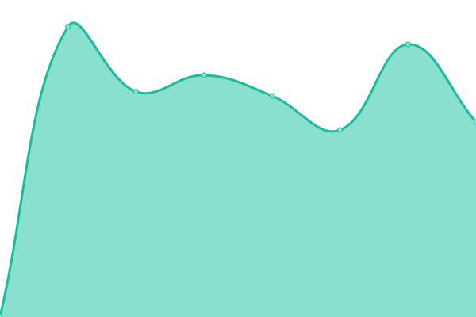
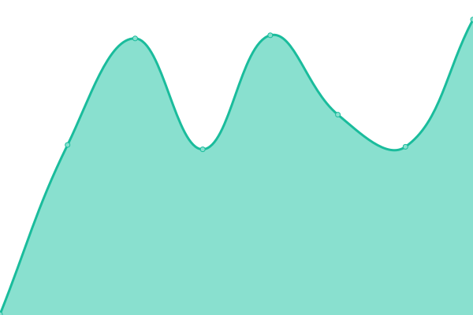
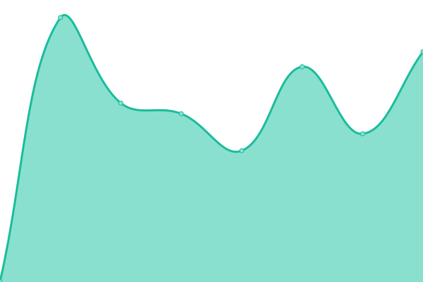
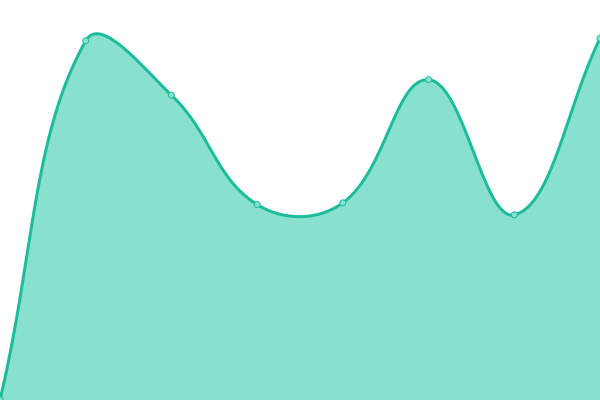

# [📈 Live Status](https://SAMS-UK.github.io/uptime): <!--live status--> **🟩 All systems operational**

This repository contains the open-source uptime monitor and status page for [Alan MacDonald](https://SAMS-UK.github.io/uptime), powered by [Upptime](https://github.com/upptime/upptime).

With [Upptime](https://upptime.js.org), you can get your own unlimited and free uptime monitor and status page, powered entirely by a GitHub repository. We use [Issues](https://github.com/SAMS-UK/uptime/issues) as incident reports, [Actions](https://github.com/SAMS-UK/uptime/actions) as uptime monitors, and [Pages](https://SAMS-UK.github.io/uptime) for the status page.

<!--start: status pages-->
<!-- This summary is generated by Upptime (https://github.com/upptime/upptime) -->
<!-- Do not edit this manually, your changes will be overwritten -->
<!-- prettier-ignore -->
| URL | Status | History | Response Time | Uptime |
| --- | ------ | ------- | ------------- | ------ |
|  [HAB Reports](https://www.habreports.org/) | 🟩 Up | [hab-reports.yml](https://github.com/SAMS-UK/uptime/commits/HEAD/history/hab-reports.yml) | 

 798ms
     
 | 

<a href="https://SAMS-UK.github.io/uptime/history/hab-reports">100.00%</a>
    

|  [Thredds](https://thredds.sams.ac.uk/thredds/catalog/catalog.html) | 🟩 Up | [thredds.yml](https://github.com/SAMS-UK/uptime/commits/HEAD/history/thredds.yml) | 

 848ms
     
 | 

<a href="https://SAMS-UK.github.io/uptime/history/thredds">97.30%</a>
    

|  [IFCB Dashboard](https://ifcb-data.sams.ac.uk/) | 🟩 Up | [ifcb-dashboard.yml](https://github.com/SAMS-UK/uptime/commits/HEAD/history/ifcb-dashboard.yml) | 

 8669ms
     
 | 

<a href="https://SAMS-UK.github.io/uptime/history/ifcb-dashboard">24.46%</a>
    

|  [SkateSpotter](https://skatespotter.sams.ac.uk/) | 🟩 Up | [skate-spotter.yml](https://github.com/SAMS-UK/uptime/commits/HEAD/history/skate-spotter.yml) | 

 550ms
     
 | 

<a href="https://SAMS-UK.github.io/uptime/history/skate-spotter">100.00%</a>
    

|  [HAB Reports (Django)](https://www.habreports.org/habappusers/info/) | 🟩 Up | [hab-reports-django.yml](https://github.com/SAMS-UK/uptime/commits/HEAD/history/hab-reports-django.yml) | 

 322ms
     
 | 

<a href="https://SAMS-UK.github.io/uptime/history/hab-reports-django">100.00%</a>
    

|  [SIMBA](https://simba.sams-enterprise.com) | 🟩 Up | [simba.yml](https://github.com/SAMS-UK/uptime/commits/HEAD/history/simba.yml) | 

 542ms
     
 | 

<a href="https://SAMS-UK.github.io/uptime/history/simba">100.00%</a>
    

|  [CCAP](https://www.ccap.ac.uk/) | 🟩 Up | [ccap.yml](https://github.com/SAMS-UK/uptime/commits/HEAD/history/ccap.yml) | 

 1000ms
     
 | 

<a href="https://SAMS-UK.github.io/uptime/history/ccap">100.00%</a>
    

|  [CCAP Catalogue](https://www.ccap.ac.uk/catalogue) | 🟩 Up | [ccap-catalogue.yml](https://github.com/SAMS-UK/uptime/commits/HEAD/history/ccap-catalogue.yml) | 

 268ms
     
 | 

<a href="https://SAMS-UK.github.io/uptime/history/ccap-catalogue">100.00%</a>
    

<!--end: status pages-->

[**Visit our status website →**](https://SAMS-UK.github.io/uptime)

## 📄 License

- Powered by: [Upptime](https://github.com/upptime/upptime)
- Code: [MIT](./LICENSE) © [Anand Chowdhary](https://anandchowdhary.com), supported by [Pabio](https://pabio.com)
- Data in the `./history` directory: [Open Database License](https://opendatacommons.org/licenses/odbl/1-0/)
